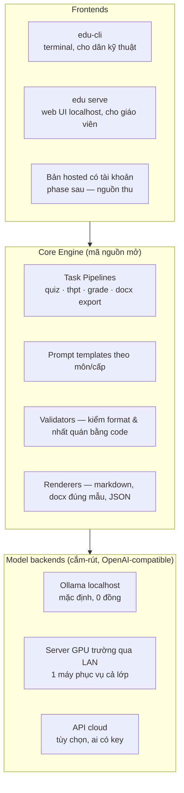

# AI for Edu — Đặc tả dự án tổng (Master Spec)

**Phiên bản:** 0.2 · **Ngày:** 15/09/2026 · **Chủ dự án:** ANTHU
**Trạng thái:** Đã pivot từ KidCode (app cho trẻ em) sang nền tảng AI giáo dục rộng hơn, **làm tool cho giáo viên trước**.

---

## 1. Tầm nhìn & định vị

AI for Edu là hệ sinh thái công cụ AI cho giáo dục Việt Nam, xây theo triết lý:

> **Local-first, không rào cản API key, format chuẩn Việt Nam, giáo viên là người kiểm soát chất lượng cuối.**

Định vị so với thị trường:

- So với **EdTech Corner** (thầy Như Anh — xem `docs/research/khao-sat-edtechcorner.md`): họ miễn phí nhưng bắt người dùng tự lấy API key Gemini, không tài khoản, không lưu trữ, chỉ tiếng Anh. Mình giải đúng các khoảng trống đó: chạy model local **0 đồng**, đa môn theo GDPT 2018, xuất đúng format chuẩn (ma trận đề, mẫu docx), và về sau có thư viện đề + cộng đồng.
- So với **tool AI quốc tế** (MagicSchool, Quizizz AI...): lợi thế của mình là bám chuẩn Việt Nam (format đề THPT 2025, công văn, ma trận đặc tả của Bộ GD) và chạy được không cần trả tiền — hợp sinh viên sư phạm, giáo viên vùng khó.

**Thứ tự sản phẩm:** (1) edu-cli cho giáo viên/sinh viên sư phạm → (2) web UI local + bản hosted → (3) KidCode cho trẻ em (spec riêng đã có: `docs/kidcode-spec.md`).

## 2. Nguyên tắc kỹ thuật đã được kiểm chứng

Ba nguyên tắc dưới đây rút từ **test thực tế** với Ollama `qwen3:4b-instruct` (xem `edu-cli/samples/`), là DNA kỹ thuật của toàn dự án:

1. **Format là của code, nội dung là của model.** Cấu trúc đề thi, câu lệnh chuẩn, đánh số, layout docx — tất cả nằm trong template code, model chỉ điền vào ô. Kết quả: format đúng 100% bất kể model mạnh yếu (đã chứng minh với section "Điền từ vào thông báo" đề THPT 2025).
2. **Không tin model ở chi tiết — validate bằng code.** Test cho thấy model 4B trả chỉ số đáp án mâu thuẫn giải thích (2/4 câu), dồn đáp án đúng vào một vị trí, sinh lựa chọn lệch blank. Các lớp chống lỗi đã cài: JSON Schema ép cấu trúc; model trả *nội dung* đáp án đúng để code tự đối chiếu ra chỉ số; xáo trộn vị trí lựa chọn bằng code; validator cảnh báo cho người duyệt.
3. **Tác vụ khó thì chia nhỏ pipeline, không đổi model to hơn ngay.** Soạn đề chuẩn khảo thí vượt sức 4B nếu làm một phát; chia thành viết đoạn → code đục lỗ → sinh nhiễu từng blank thì model nhỏ làm nổi. Model lớn (8B–32B) là đòn bẩy thêm, không phải điều kiện tiên quyết.

## 3. Kiến trúc



- **Ngôn ngữ:** Python 3.9+ (prototype hiện tại), chỉ phụ thuộc `requests`; giữ chân cài đặt nhẹ nhất có thể.
- **Ba chế độ chạy cùng một code:** local (mặc định) · `--host` trỏ server GPU của trường · endpoint cloud. Đây là lời giải cho "sinh viên không tiền API key".
- **Khuyến nghị cỡ model (đã test):** 4B (q4) = mức sàn cho máy 8GB RAM; **8B–12B = mặc định khuyến nghị** (16GB/Mac M-series); 14B cho máy có GPU; 27B–32B cho server trường. Dưới 4B không dùng. Tác vụ soạn đề chuẩn khảo thí: dùng pipeline chia nhỏ nếu chạy 4B.

## 4. Lộ trình sản phẩm

### Phase 1 — edu-cli (đang làm)
- [x] `edu quiz`: sinh trắc nghiệm tiếng Việt từ văn bản (đã có, đã test 2 vòng)
- [x] `edu thpt --section notice`: proof-of-concept đúng format đề THPT 2025 (format ✅, nội dung cần pipeline chia nhỏ)
- [ ] Pipeline chia nhỏ cho các dạng bài THPT (đủ 6 dạng, 40 câu)
- [ ] Xuất `.docx` đúng mẫu đề in + ma trận đặc tả
- [ ] `edu serve`: web UI localhost — cửa vào cho người không dùng terminal
- [ ] Đóng gói cài đặt 1 lệnh (pipx / installer kèm hướng dẫn Ollama)

### Phase 2 — Phủ môn học & chấm bài
Đa môn theo GDPT 2018 (Toán, KHTN, Văn...) · `edu grade`: chấm bài từ ảnh chụp (vision model local) · ngân hàng đề cá nhân (SQLite local).

### Phase 3 — Cộng đồng & mô hình open-core
Bản hosted: tài khoản, thư viện đề chia sẻ giữa giáo viên, cộng tác — đây là bản thu phí; CLI/local mãi miễn phí để xây cộng đồng (học cách thầy Như Anh xây uy tín, nhưng có đường doanh thu). Kênh phân phối: workshop giáo viên, trường sư phạm, cộng đồng Facebook giáo dục.

### Phase 4 — KidCode
Nền tảng cho trẻ em 6–15 làm dự án STEM (robot, smarthome, IoT) — spec đầy đủ tại `docs/kidcode-spec.md`. Tái dùng Core Engine + hạ tầng AI orchestration của các phase trước.

## 5. Cấu trúc repo

```
ai-for-edu/
├── README.md
├── docs/
│   ├── ai-for-edu-spec.md      ← tài liệu này (master spec)
│   ├── kidcode-spec.md          ← spec KidCode (Phase 4)
│   └── research/
│       └── khao-sat-edtechcorner.md
└── edu-cli/                     ← sản phẩm Phase 1
    ├── README.md                ← hướng dẫn cài & khuyến nghị model
    ├── educli/
    │   ├── main.py              ← edu quiz
    │   └── thpt.py              ← edu thpt (demo format đề 2025)
    └── samples/                 ← output test thật
```

## 6. Chỉ số thành công Phase 1

Cài đặt thành công trong < 10 phút trên máy 8GB RAM · sinh 1 đề 40 câu đúng format < 15 phút trên laptop phổ thông · tỷ lệ câu hỏi giáo viên chấp nhận không sửa > 70% · 100 người dùng thật đầu tiên từ 1–2 trường sư phạm.
