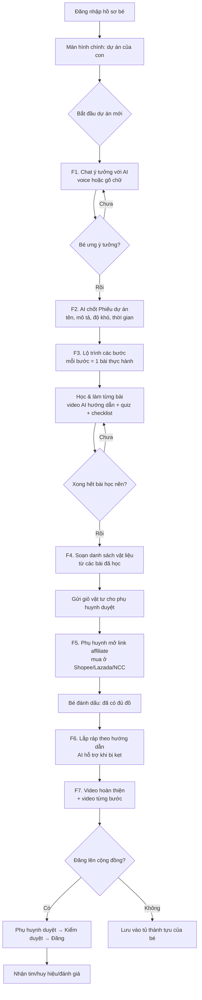
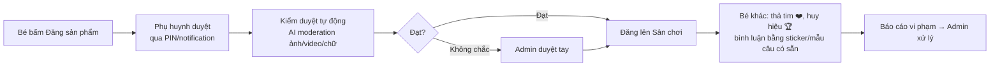
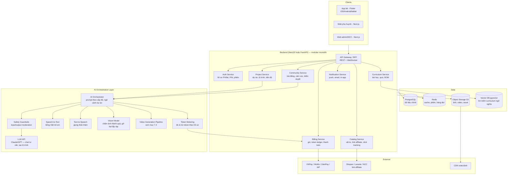
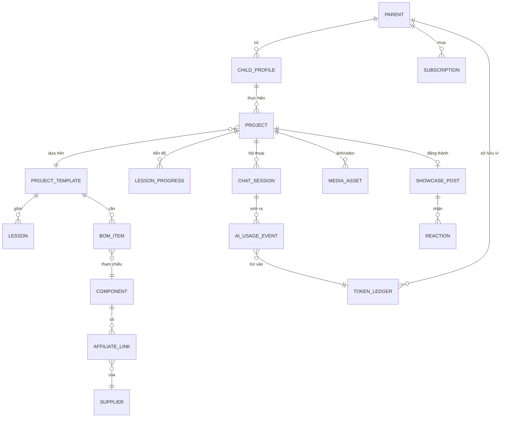

# KidCode — Tài liệu Đặc tả Sản phẩm (Product Spec)

**Phiên bản:** 0.1 (Draft) · **Ngày:** 17/07/2026
**Nền tảng cho trẻ em 6–15 tuổi trải nghiệm sáng tạo công nghệ: robot, smarthome, IoT và hơn thế nữa**

---

## 1. Tổng quan sản phẩm

### 1.1. Tầm nhìn

KidCode là "người bạn đồng hành AI" giúp trẻ em biến ý tưởng công nghệ thành sản phẩm thật cầm được trên tay. Bé nói ra ý tưởng ("con muốn làm robot tưới cây"), AI tư vấn và chốt dự án, dẫn bé qua từng bước học – thực hành – chuẩn bị vật liệu – lắp ráp, và kết thúc bằng một video thành quả để bé khoe với gia đình và cộng đồng.

### 1.2. Giá trị cốt lõi

- **Với bé:** học qua làm (learning by making), có sản phẩm thật, có video thành quả, có cộng đồng để khoe và được khen.
- **Với phụ huynh:** con dùng thiết bị điện tử một cách có ích, lộ trình rõ ràng, chi phí minh bạch, an toàn nội dung.
- **Với KidCode:** doanh thu từ gói subscription + token AI, hoa hồng affiliate vật tư, về sau là kit riêng mang thương hiệu KidCode.

### 1.3. Quyết định phạm vi đã chốt

| Hạng mục | Quyết định |
|---|---|
| Độ tuổi | 6–15 tuổi, chia 3 cấp độ (Mầm 6–9, Chồi 10–12, Lá 13–15) |
| Nền tảng | App mobile/tablet cho bé + Web portal cho phụ huynh/admin/NCC |
| Phần cứng | Giai đoạn đầu dùng kit thị trường (micro:bit, Arduino, Yolo:Bit, ESP32...), sau ra kit KidCode riêng |
| Mua vật tư | Affiliate/link ra ngoài (Shopee, Lazada, web NCC) — KidCode không xử lý đơn hàng |
| Video | AI generate video hướng dẫn theo từng bước (có phương án dự phòng — xem mục 7.4) |
| Thu tiền | Subscription theo gói + nạp thêm token khi hết hạn mức |
| MVP | Flow chính của bé + cổng phụ huynh/thanh toán + cộng đồng + portal vật tư (mức tối giản) |

---

## 2. Người dùng & Personas

### 2.1. Bé (người dùng chính — app mobile/tablet)

| Cấp độ | Tuổi | Đặc điểm | UX chủ đạo |
|---|---|---|---|
| 🌱 Mầm | 6–9 | Đọc chậm, chưa gõ phím tốt | Voice-first (speech-to-text), icon to, ít chữ, AI đọc to câu trả lời (TTS), dự án lắp ráp đơn giản không code hoặc code kéo-thả |
| 🌿 Chồi | 10–12 | Đọc viết tốt, bắt đầu tư duy logic | Chat gõ + voice, code kéo-thả (Blockly/MakeCode) → chuyển dần sang code chữ, dự án micro:bit/Yolo:Bit |
| 🍀 Lá | 13–15 | Gần như người lớn | Chat như ChatGPT, code Python/C++ thật, dự án Arduino/ESP32, IoT kết nối app |

Cấp độ quyết định: giọng văn của AI, độ phức tạp lộ trình, loại bài thực hành, và danh mục vật tư được gợi ý.

### 2.2. Phụ huynh (web portal + có thể xem trên app)

- Tạo tài khoản, tạo hồ sơ cho từng bé, chọn cấp độ.
- Mua gói, nạp token, xem lịch sử dùng token.
- **Duyệt giỏ vật tư trước khi bé được dẫn sang link mua** (bé không tự thanh toán).
- Theo dõi tiến độ, nhận thông báo khi bé hoàn thành cột mốc.
- Duyệt/cho phép bé đăng sản phẩm lên cộng đồng.

### 2.3. Admin KidCode (web portal nội bộ)

- Quản lý danh mục vật tư, link affiliate, giá tham khảo, tình trạng còn hàng.
- Quản lý thư viện dự án mẫu & bài thực hành (curriculum).
- Kiểm duyệt nội dung cộng đồng, xử lý báo cáo.
- Quản lý gói cước, hạn mức token, khuyến mãi.
- Dashboard vận hành: người dùng, doanh thu, chi phí AI.

### 2.4. Nhà cung cấp — NCC (web portal, mức tối giản ở MVP)

- Với mô hình affiliate: NCC chủ yếu do admin quản lý hộ (nhập link, giá). Phase sau mới mở portal cho NCC tự cập nhật tồn kho/giá và xem lượt click/chuyển đổi.

---

## 3. User Flow chi tiết

### 3.1. Sơ đồ flow chính của bé (end-to-end)

### 3.2. F0 — Onboarding & đăng nhập

1. **Phụ huynh** tải app/vào web → đăng ký bằng số điện thoại/email/Google/Apple.
2. Phụ huynh tạo **hồ sơ bé**: tên gọi thân mật, năm sinh (→ hệ thống gợi ý cấp độ), avatar (chọn từ bộ có sẵn — không dùng ảnh thật để an toàn).
3. Phụ huynh đặt **mã PIN phụ huynh** (chặn bé vào phần thanh toán/cài đặt).
4. Trên thiết bị của bé: màn hình chọn hồ sơ kiểu Netflix Kids → bé chạm avatar của mình là vào, không cần mật khẩu.
5. Lần đầu vào, AI chào bé bằng giọng nói, hỏi bé thích gì (robot? nhà thông minh? xe? đèn?) → cá nhân hóa gợi ý.

**Màn hình:** Đăng ký/Đăng nhập (PH) · Tạo hồ sơ bé · Chọn hồ sơ · Chào mừng + khảo sát sở thích.

### 3.3. F1 — Chat ý tưởng với AI (màn hình kiểu ChatGPT/Gemini cho trẻ em)

**Mục tiêu:** từ ý tưởng mơ hồ của bé → một dự án khả thi, đúng cấp độ, trong ngân sách.

- Khung chat lớn, nút **micro to ở giữa** (speech-to-text là mặc định cho cấp Mầm; cấp Chồi/Lá có thêm bàn phím).
- AI trả lời bằng **chữ + đọc to (TTS)** với cấp Mầm; kèm hình minh họa gợi ý.
- AI đóng vai "Kỹ sư nhí đồng hành": hỏi lại để làm rõ (làm để làm gì? đặt ở đâu? con thích màu gì?), gợi ý 2–3 phương án từ dễ đến khó, **luôn neo về các dự án có trong thư viện curriculum** để đảm bảo có bài học và vật tư tương ứng.
- Có **gợi ý nhanh** dạng thẻ hình ảnh cho bé chưa có ý tưởng: "Robot mèo", "Đèn ngủ thông minh", "Vườn tự tưới"...
- Khi bé đồng ý → AI tạo **Phiếu dự án (Project Card)**: tên dự án, mô tả 1 câu, ảnh minh họa (AI gen), độ khó, số bài học, thời gian ước tính, khoảng chi phí vật tư dự kiến.
- **Guardrails:** AI chỉ nói chuyện trong chủ đề STEM/sáng tạo; từ chối mềm và lái về chủ đề an toàn nếu bé hỏi ngoài lề; không bao giờ gợi ý dụng cụ nguy hiểm vượt cấp độ (dao, hàn, điện lưới 220V...); nội dung nhạy cảm bị chặn từ tầng moderation.

**Màn hình:** Chat ý tưởng (voice + text) · Thẻ gợi ý dự án · Phiếu dự án (xác nhận).

### 3.4. F2–F3 — Lộ trình các bước & bài thực hành

- Lộ trình hiển thị dạng **bản đồ hành trình** (như Duolingo): mỗi chặng là một bài, mở khóa dần.
- Cấu trúc 1 bài thực hành:
  1. **Video hướng dẫn** (AI generate — xem mục 7.4) 1–3 phút.
  2. **Làm theo:** checklist từng thao tác, ảnh minh họa; bé tick ✅ khi xong.
  3. **Quiz vui** 2–3 câu (cấp Mầm: chọn hình; cấp Lá: câu hỏi kỹ thuật).
  4. **Nộp bằng chứng (tùy chọn):** bé chụp ảnh thành quả của bài → AI khen + góp ý (vision model).
- Bé có thể bấm **"Con bị kẹt!"** ở bất kỳ đâu → mở chat AI với ngữ cảnh đúng bài đang học.
- Hoàn thành bài → nhận **sao/huy hiệu**, mở khóa bài kế. Xong hết phần học nền → mở khóa bước "Chuẩn bị vật liệu".

**Màn hình:** Bản đồ lộ trình · Chi tiết bài học (video/checklist/quiz) · Chat trợ giúp trong bài · Màn nhận thưởng.

### 3.5. F4–F5 — Soạn vật liệu & mua qua affiliate

- Hệ thống tự tổng hợp **BOM (danh sách vật liệu)** của dự án từ curriculum: tên linh kiện, ảnh, số lượng, giá tham khảo, ghi chú "đã học ở bài số mấy".
- Bé tick những món **đã có sẵn ở nhà** (AI gợi ý đồ thay thế: "hộp sữa chua thay cho thân robot cũng được đó!").
- Những món còn thiếu → bé bấm **"Nhờ ba mẹ mua giúp"** → giỏ vật tư được gửi sang tài khoản phụ huynh (notification + email).
- **Phụ huynh** mở giỏ trên portal/app: mỗi món có 1–3 link affiliate (Shopee/Lazada/web NCC) kèm giá tham khảo → phụ huynh bấm link mua trực tiếp ở sàn, KidCode ghi nhận click để tính hoa hồng.
- Phụ huynh (hoặc bé) đánh dấu **"Đã có đủ đồ"** → mở khóa giai đoạn lắp ráp.

**Màn hình bé:** Danh sách vật liệu (BOM) · Tick đồ có sẵn · Gửi giỏ cho ba mẹ.
**Màn hình PH:** Giỏ vật tư chờ duyệt · Chi tiết món + link mua · Xác nhận đủ đồ.

### 3.6. F6–F7 — Lắp ráp & video thành quả

- Giai đoạn lắp ráp: hướng dẫn từng bước tương tự bài học (video AI + checklist), có nút "Con bị kẹt!" với khả năng **gửi ảnh chỗ đang lắp** để AI nhìn và chỉ chỗ sai.
- Hoàn thành → màn **"Khoảnh khắc tốt nghiệp"**:
  - App tự tổng hợp **video hoàn thiện của dự án**: intro tên bé + tên dự án, các video/ảnh từng bước đã lưu trong quá trình làm, video AI minh họa, outro chúc mừng — render thành 1 video dọc 60–90 giây kiểu TikTok/Reels.
  - Kèm **playlist video các bước** để bé xem lại hoặc bạn khác làm theo.
- Bé chọn: **Lưu vào Tủ thành tựu** (riêng tư) hoặc **Đăng lên Sân chơi** (cộng đồng) → cần phụ huynh duyệt.

**Màn hình:** Hướng dẫn lắp ráp · Chụp/quay từng bước · Xem video thành quả · Chọn đăng/lưu.

### 3.7. Flow cộng đồng — "Sân chơi KidCode"

- **Đánh giá sản phẩm:** để an toàn cho trẻ, không cho bình luận tự do ở cấp Mầm/Chồi — chỉ **thả cảm xúc + sticker + mẫu câu khen có sẵn** ("Tuyệt quá!", "Mình cũng muốn làm!"). Cấp Lá có thể bình luận chữ nhưng qua AI moderation trước khi hiện.
- Bảng xếp hạng theo tuần/chủ đề, huy hiệu "Nhà sáng chế của tháng".
- Từ một sản phẩm trên Sân chơi, bé khác bấm **"Mình muốn làm cái này!"** → nhảy thẳng vào flow F2 với dự án tương ứng (viral loop quan trọng nhất của sản phẩm).

### 3.8. Flow phụ huynh — mua gói & token

1. Vào **Cửa hàng gói**: Free (trải nghiệm 1 dự án mini, hạn mức token nhỏ) · Basic (1 bé, X token/tháng) · Family (tối đa 3 bé, Y token/tháng) · Pro (Z token + ưu tiên tính năng mới).
2. Thanh toán: VNPay/MoMo/ZaloPay/thẻ (web) và In-App Purchase (iOS/Android — lưu ý phí 15–30% của store, nên đẩy thanh toán về web).
3. **Đồng hồ token:** phụ huynh thấy hạn mức còn lại, lịch sử tiêu token theo từng hoạt động của bé (chat, tạo video...). Hết hạn mức → mua **gói token nạp thêm**.
4. Trong app của bé **không bao giờ hiện giá tiền/token** — khi hết token, bé thấy thông báo dễ thương "Nhờ ba mẹ tiếp thêm năng lượng cho trợ lý nhé!" và phụ huynh nhận notification.
5. Báo cáo tiến độ hàng tuần qua email/notification: bé học gì, làm tới đâu, khoe video thành quả.

### 3.9. Flow admin & vật tư (MVP tối giản)

- CRUD danh mục linh kiện: tên, ảnh, thông số, cấp độ phù hợp, giá tham khảo, 1–n link affiliate theo NCC, trạng thái còn hàng (cập nhật tay hoặc crawl định kỳ).
- Gắn linh kiện vào BOM của từng dự án trong curriculum.
- Xem thống kê click affiliate theo NCC/dự án (để đàm phán hoa hồng).
- Hàng đợi kiểm duyệt cộng đồng + xử lý báo cáo.
- Quản lý curriculum: dự án mẫu, bài học, quiz, prompt template cho AI.

---

## 4. Kiến trúc hệ thống (Architecture)

### 4.1. Sơ đồ tổng thể

### 4.2. Lựa chọn công nghệ đề xuất

| Tầng | Đề xuất | Lý do |
|---|---|---|
| App bé | **Flutter** | 1 codebase cho iOS/Android/tablet, animation mượt phù hợp trẻ em, hỗ trợ mic/camera tốt |
| Web PH/Admin | **Next.js + TypeScript** | SSR nhanh, hệ sinh thái lớn, dễ tuyển dev VN |
| Backend | **NestJS (Node/TS)** dạng **modular monolith** | Team nhỏ đi nhanh; tách service sau khi có tải. FastAPI (Python) là phương án thay thế nếu team mạnh Python/AI |
| CSDL | **PostgreSQL + pgvector** | Một CSDL cho cả dữ liệu quan hệ và vector search, giảm vận hành |
| Cache/Queue | **Redis + BullMQ** | Hàng đợi cho job nặng: render video, moderation, gửi noti |
| Storage | **S3-compatible** (AWS S3/Cloudflare R2) + CDN | Video là loại dữ liệu nặng nhất của hệ thống |
| LLM | **Claude / GPT qua API**, model nhỏ cho việc nhẹ | Định tuyến model theo tác vụ để tối ưu chi phí (xem 7.2) |
| STT/TTS | Google Cloud Speech / Azure Speech (tiếng Việt tốt), TTS giọng VN thân thiện | Chất lượng tiếng Việt là bắt buộc |
| Realtime | WebSocket (chat AI streaming) | Trải nghiệm chat mượt như ChatGPT |
| Hạ tầng | Docker + 1 cloud (AWS/GCP) hoặc VPS VN giai đoạn đầu | Đơn giản trước, scale sau |

### 4.3. Nguyên tắc kiến trúc

1. **Modular monolith trước, microservices sau** — các module tách rõ ranh giới (Auth/Project/Billing/AI...) trong 1 deploy; khi nào tải lớn mới tách, tránh over-engineering ở MVP.
2. **AI Orchestrator là trái tim** — mọi lời gọi AI đi qua 1 lớp duy nhất: gắn system prompt theo cấp độ tuổi, gắn ngữ cảnh dự án (RAG từ curriculum), qua guardrails 2 chiều, và đo token. Không client nào gọi thẳng LLM.
3. **Job nặng chạy nền** — render video, chấm ảnh, moderation đều qua queue; client nhận kết quả qua WebSocket/push, không giữ request chờ.
4. **Curriculum là dữ liệu, không phải code** — dự án mẫu, bài học, BOM, prompt template đều là bản ghi trong DB để admin/giáo viên cập nhật không cần deploy.
5. **An toàn trẻ em là tầng bắt buộc** (mục 8), không phải tính năng tùy chọn.

---

## 5. Data Model (các thực thể chính)

**Ghi chú các thực thể chính:**

- **parent** (id, email/sđt, PIN hash, phương thức thanh toán) · **child_profile** (id, parent_id, nickname, năm sinh, cấp độ, avatar, sở thích, tổng sao/huy hiệu).
- **project_template** (curriculum): tên, mô tả, cấp độ, chủ đề robot/smarthome/IoT, thời lượng, embedding vector; **lesson**: thứ tự, nội dung checklist, quiz JSON, video_asset_id, prompt ngữ cảnh trợ giúp; **bom_item**: component_id, số lượng, có thể thay thế bằng gì.
- **project** (instance của bé): template_id, child_id, trạng thái (ideation → learning → sourcing → building → done), phiếu dự án JSON do AI chốt.
- **component**: tên, ảnh, thông số, giá tham khảo, cấp độ an toàn; **affiliate_link**: url, supplier_id, giá lúc cập nhật, click_count.
- **subscription**: gói, chu kỳ, trạng thái; **token_ledger**: số dư, các bút toán cộng (mua gói/nạp thêm) và trừ (ai_usage_event) — thiết kế dạng sổ cái bất biến (append-only) để đối soát.
- **ai_usage_event**: loại tác vụ (chat/stt/tts/vision/video), model, token in/out, chi phí thật (USD), token quy đổi trừ người dùng, child_id, project_id — vừa để trừ tiền vừa để phân tích biên lợi nhuận.
- **showcase_post**: project_id, video_url, trạng thái duyệt (parent_pending → auto_mod → admin_review → published), reaction counts.
- **moderation_log**: đối tượng, model score, quyết định, admin xử lý.

---

## 6. Đặc tả tích hợp AI

### 6.1. Các tác vụ AI trong hệ thống

| # | Tác vụ | Model đề xuất | Tần suất | Chi phí tương đối |
|---|---|---|---|---|
| 1 | Chat tư vấn ý tưởng | LLM tầm trung, streaming | Rất cao | ●●○○ |
| 2 | Sinh Phiếu dự án + lộ trình cá nhân hóa | LLM mạnh (1 lần/dự án) | Thấp | ●●●○ |
| 3 | Trợ giúp trong bài ("Con bị kẹt!") | LLM tầm trung + RAG bài học | Cao | ●●○○ |
| 4 | STT tiếng Việt (giọng trẻ em) | Cloud STT | Rất cao | ●○○○ |
| 5 | TTS giọng thân thiện | Cloud TTS (cache câu lặp lại) | Cao | ●○○○ |
| 6 | Chấm ảnh thành quả / gỡ kẹt bằng ảnh | Vision model | Trung bình | ●●○○ |
| 7 | Sinh ảnh minh họa dự án | Image gen (1–2 ảnh/dự án) | Thấp | ●●○○ |
| 8 | **Video hướng dẫn AI** | Pipeline riêng (7.4) | Thấp nhưng đắt | ●●●● |
| 9 | Moderation nội dung | Model moderation + rule | Theo sự kiện | ●○○○ |

### 6.2. Chiến lược tối ưu chi phí token

- **Định tuyến model:** việc nhẹ (chào hỏi, quiz, khen bé) → model nhỏ rẻ; việc nặng (thiết kế lộ trình, chẩn đoán lỗi lắp ráp) → model mạnh.
- **Cache mạnh tay:** TTS các câu cố định, video/lộ trình của dự án mẫu phổ biến render 1 lần dùng nhiều lần (chỉ cá nhân hóa phần intro/outro), prompt caching cho system prompt dài.
- **RAG thay vì context dài:** nhúng curriculum vào pgvector, chỉ đưa đoạn liên quan vào prompt.
- **Token quy đổi:** không bán "token API thô" cho người dùng — quy đổi thành đơn vị thân thiện (ví dụ "⚡ năng lượng"), 1 hành động = n ⚡ cố định (1 câu chat = 1⚡, 1 video bước = 20⚡...) để phụ huynh dễ hiểu và mình chủ động biên lợi nhuận.

### 6.3. Prompt architecture

- **System prompt 3 lớp:** (1) nhân cách "Kỹ sư nhí" + quy tắc an toàn trẻ em bất biến; (2) lớp cấp độ tuổi (từ vựng, độ dài câu, ví dụ); (3) lớp ngữ cảnh (dự án hiện tại, bài đang học, lịch sử gần nhất).
- Prompt template lưu trong DB, có version, admin chỉnh không cần deploy; A/B test được.

### 6.4. Guardrails an toàn AI (bắt buộc, 2 chiều)

- **Đầu vào:** lọc chủ đề không phù hợp trước khi tới LLM; phát hiện thông tin cá nhân bé vô tình nói ra (địa chỉ, trường học) → không lưu, nhắc bé không chia sẻ.
- **Đầu ra:** moderation model + rule: không hướng dẫn thao tác nguy hiểm ngoài cấp độ (điện 220V, vật sắc nhọn, hàn thiếc cho cấp Mầm...), không link ngoài, không thu thập thông tin bé.
- Mọi hội thoại lưu lại, **phụ huynh xem được toàn bộ lịch sử chat của con**.

---

## 7. Các thiết kế kỹ thuật đáng chú ý

### 7.1. Token Metering (đo & trừ token)

Luồng: client gọi AI → Orchestrator kiểm tra số dư ⚡ (Redis cache số dư) → thực thi → ghi `ai_usage_event` (token thật + chi phí thật + ⚡ trừ) → bút toán trừ vào `token_ledger` → đẩy số dư mới về client. Hết ⚡ giữa chừng: cho phép hoàn thành hành động hiện tại, chặn hành động mới, gửi noti cho phụ huynh kèm deep-link mua thêm.

### 7.2. Click tracking affiliate

Link mua = link redirect qua domain KidCode (`go.kidcode.vn/c/{component}/{supplier}?src={parent}`) → ghi click event → redirect sang sàn với mã affiliate. Đối soát hoa hồng bằng dashboard của sàn (Shopee Affiliate, Accesstrade...).

### 7.3. Kiểm duyệt cộng đồng 3 lớp

(1) Phụ huynh duyệt → (2) AI moderation ảnh/video/chữ (chặn mặt trẻ em lộ rõ nếu phụ huynh chọn ẩn danh, chặn thông tin cá nhân trong khung hình) → (3) mẫu ngẫu nhiên + báo cáo do admin duyệt tay. SLA duyệt < 24h.

### 7.4. ⚠️ Pipeline video AI — thiết kế thực dụng (khuyến nghị quan trọng)

Anh đã chọn "AI generate video hướng dẫn". Em khuyến nghị **không dùng text-to-video thuần** (kiểu Sora/Veo) cho video hướng dẫn kỹ thuật, vì: chi phí rất cao mỗi lần render, và model video hiện **không đảm bảo chính xác kỹ thuật** (cắm sai chân mạch, sai linh kiện) — sai một chi tiết là bé làm hỏng, mất niềm tin. Thay vào đó dùng **pipeline video tổng hợp (composited)**:

1. **Kịch bản:** LLM sinh script + lời thoại theo cấp độ tuổi (rẻ, kiểm soát được).
2. **Hình ảnh:** ảnh linh kiện thật từ thư viện + sơ đồ đấu nối render từ dữ liệu BOM (Fritzing-style, chính xác 100%) + ảnh AI gen chỉ cho phần minh họa cảm hứng.
3. **Giọng đọc:** TTS giọng VN thân thiện.
4. **Ghép:** template motion-graphics (Remotion/FFmpeg) render nền qua queue → video ngắn có phụ đề, nhạc, nhân vật mascot.
5. Video của **dự án mẫu render 1 lần, cache dùng chung**; chỉ video "hoàn thiện cá nhân" (ghép ảnh/clip bé chụp trong quá trình làm + intro/outro tên bé) là render riêng cho từng bé.

Kết quả: vẫn là "AI làm video" đúng ý anh, nhưng chi phí rẻ hơn hàng chục lần và nội dung kỹ thuật chính xác tuyệt đối. Text-to-video thuần có thể thêm sau cho phần intro cảm hứng khi giá rẻ đi.

---

## 8. An toàn trẻ em & tuân thủ pháp lý

- **Nghị định 13/2023/NĐ-CP (bảo vệ dữ liệu cá nhân VN):** dữ liệu trẻ em cần sự đồng ý của cha mẹ — flow onboarding đã thiết kế phụ huynh là chủ tài khoản, bé chỉ là hồ sơ con. Nếu ra quốc tế: COPPA (Mỹ), GDPR-K (EU).
- Thu thập dữ liệu tối thiểu: không ảnh thật làm avatar, không định vị, không quảng cáo hành vi.
- Toàn bộ giao dịch tiền nằm phía phụ huynh (PIN bảo vệ); app của bé không có bất kỳ nút thanh toán nào.
- Giới hạn thời gian dùng app/ngày do phụ huynh đặt (screen-time) — vừa là tính năng bán hàng cho phụ huynh.
- Lịch sử chat AI của bé minh bạch 100% với phụ huynh.
- Cân nhắc chứng nhận kidSAFE/ESRB Privacy khi mở rộng thị trường.

---

## 9. Mô hình doanh thu

| Nguồn thu | Cơ chế |
|---|---|
| **Subscription** | Free (1 dự án mini, ít ⚡) · Basic ~149k/tháng (1 bé) · Family ~249k/tháng (3 bé) · trả năm giảm ~20% *(giá minh họa, cần khảo sát)* |
| **Nạp ⚡ thêm** | Gói 50k/100k/200k khi vượt hạn mức tháng |
| **Affiliate vật tư** | Hoa hồng 3–10% qua Shopee/Lazada Affiliate, Accesstrade, deal trực tiếp NCC linh kiện (hshop, nshop, banlinhkien...) |
| **Tương lai** | Kit KidCode đóng gói theo dự án hot nhất (biên tốt, đã có số liệu nhu cầu từ affiliate) · gói trường học/trung tâm STEM (B2B) · sự kiện cuộc thi |

---

## 10. Lộ trình MVP

### Phase 0 — Nền móng (tuần 1–4)
Thiết kế UI/UX chi tiết theo 3 cấp độ · dựng backend skeleton + auth + hồ sơ PH/bé · AI Orchestrator v1 (chat + guardrails + metering) · soạn **10 dự án mẫu** đầu tiên trong curriculum (đây là việc nặng nhất và quan trọng nhất — quyết định chất lượng sản phẩm).

### Phase 1 — MVP flow chính (tuần 5–12)
Chat ý tưởng (voice + text) → phiếu dự án → lộ trình → bài học (video pipeline 7.4 + checklist + quiz) → BOM → giỏ gửi phụ huynh → link affiliate → video thành quả. Cổng phụ huynh: mua gói (VNPay/MoMo), đồng hồ ⚡, xem tiến độ. Admin tối giản: quản lý curriculum + vật tư + link.

### Phase 2 — Cộng đồng & tăng trưởng (tuần 13–20)
Sân chơi (đăng + duyệt 3 lớp + reaction) · nút "Mình muốn làm cái này!" · huy hiệu, bảng xếp hạng · báo cáo tuần cho phụ huynh · đo lường & tối ưu chi phí AI theo dữ liệu thật.

### Phase 3 — Mở rộng (tháng 6+)
Portal NCC tự phục vụ · kit KidCode cho 3–5 dự án hot nhất · B2B trường học/trung tâm STEM · nhiều chủ đề mới (thời trang tech, nhạc cụ điện tử...) · cân nhắc thị trường ĐNÁ.

### Chỉ số thành công MVP
Tỷ lệ bé hoàn thành dự án đầu tiên (mục tiêu > 40%) · tỷ lệ giỏ vật tư được phụ huynh mở link (> 50%) · chi phí AI/người dùng/tháng < 30% giá gói · tỷ lệ gia hạn tháng 2 (> 60%).

---

## 11. Góp ý thêm & rủi ro cần lưu ý

1. **Curriculum là hào nước thật sự, không phải AI.** AI ai cũng gọi API được; 50 dự án mẫu được thiết kế sư phạm tốt, an toàn, vật tư dễ mua ở VN mới là thứ đối thủ khó sao chép. Nên có giáo viên STEM tham gia soạn từ Phase 0.
2. **Rủi ro lớn nhất của flow: bé bỏ cuộc ở khúc chờ vật tư** (đợi ship 2–5 ngày là mất đà hứng thú). Giải pháp: trong lúc chờ hàng, mở "nhiệm vụ chờ đồ" — bài học mô phỏng trên app (giả lập mạch trên màn hình), thiết kế decal trang trí, đặt tên robot... để giữ nhịp.
3. **Dự án đầu tiên nên làm được bằng đồ có sẵn ở nhà** (giấy bìa, chai nhựa, pin AA) — bé có thành quả ngay ngày đầu, phụ huynh thấy giá trị trước khi phải mua gì.
4. **Hạn chế phụ thuộc affiliate dài hạn:** dữ liệu click/mua chính là nghiên cứu thị trường miễn phí cho việc ra kit riêng — thiết kế tracking tốt ngay từ đầu.
5. **Chi phí video AI** là biến số lớn nhất của unit economics — pipeline 7.4 giúp kiểm soát, nhưng vẫn nên đo `ai_usage_event.chi phí thật` từng người dùng ngay từ MVP.
6. **Voice tiếng Việt giọng trẻ em** là điểm khó kỹ thuật (bé nói ngọng, nói nhỏ) — nên test STT với trẻ thật sớm ở Phase 0, có fallback chọn thẻ hình ảnh khi nhận dạng kém.
7. **Cân nhắc "chế độ làm cùng ba mẹ":** dự án cấp Mầm gần như chắc chắn cần người lớn hỗ trợ — thiết kế bài học có vai "việc của con / việc nhờ ba mẹ" biến điều này thành tính năng gắn kết gia đình thay vì điểm yếu.
8. **Tên và nhân vật mascot** nên có sớm — trợ lý AI có tên, có hình (ví dụ robot "Bo") giúp trẻ gắn bó hơn hẳn một khung chat vô danh.

---

*Tài liệu này là bản đặc tả v0.1 để thống nhất phạm vi. Bước tiếp theo đề xuất: (1) duyệt & chốt spec, (2) wireframe các màn hình chính, (3) soạn 10 dự án curriculum đầu tiên, (4) proof-of-concept pipeline video + STT tiếng Việt.*
